# INT333 
## DevOps Advance Configuration Management

## Lab Assignment - 2


> By-
> Name: Kathi Raja Ravindra,
> Redg No. 11702961,
> Roll No. B37

> Submitted to-
> Mr. Abhinav Hans


---

> [Nagios](#nagios) | [Ansible](#ansible)

---
### Nagios

* _*On Master machine*_:

``` 
sudo apt-get update
sudo apt-get install -y autoconf gcc libc6 make wget unzip apache2 php libapache2-mod-php7.2 libgd-dev
```
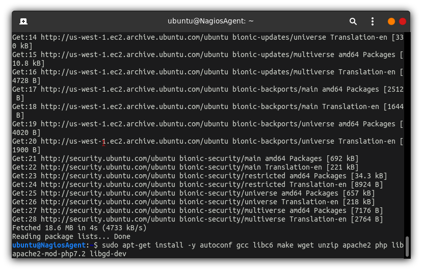

* To install nagios core.
  
```
cd /tmp
wget -O nagioscore.tar.gz https://github.com/NagiosEnterprises/nagioscore/archive/nagios-4.4.5.tar.gz
tar xzf nagioscore.tar.gz

#ToCompile

cd /tmp/nagioscore-nagios-4.4.5/
sudo ./configure --with-httpd-conf=/etc/apache2/sites-enabled
sudo make all
```
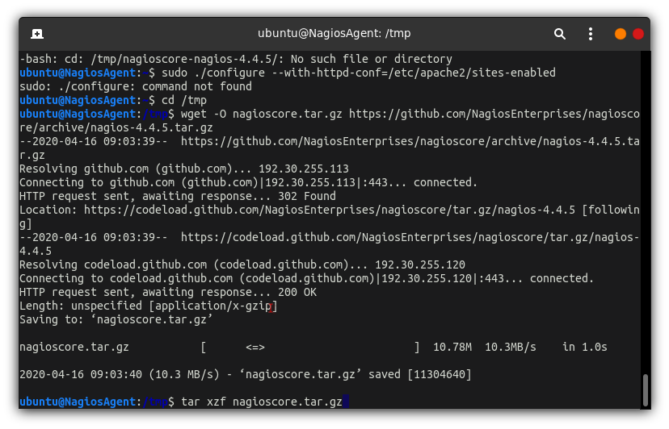
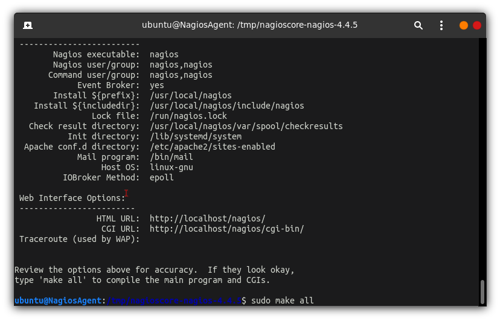

* Create User and Group, then Install required

```
#CreateUserandGroup

sudo make install-groups-users
sudo usermod -a -G nagios www-data

#Installation of binaries

sudo make install
sudo make install-daemoninit
sudo make install-commandmode
sudo make install-config
```
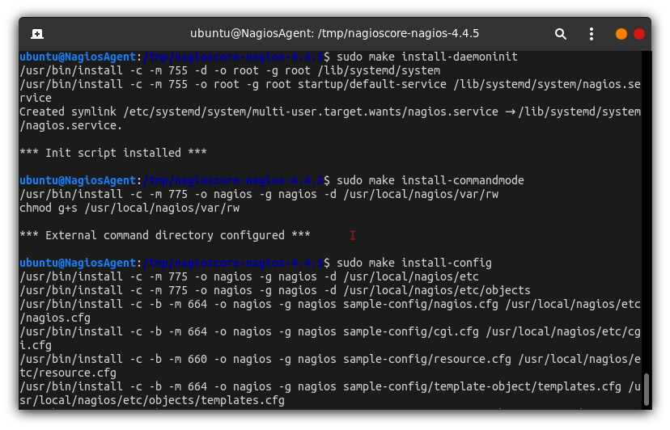

* Install Apache config files and configure firewall

```
sudo make install-webconf
sudo a2enmod rewrite
sudo a2enmod cgi

#Firewall

sudo ufw allow Apache
sudo ufw reload
```
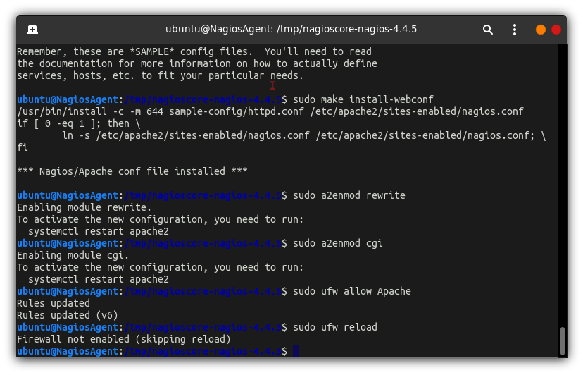

* Create userid and pass for nagios admin and start apache,nagios services:

```
sudo htpasswd -c /usr/local/nagios/etc/htpasswd.users nagiosadmin
sudo systemctl restart apache2.service
sudo systemctl start nagios.service
```
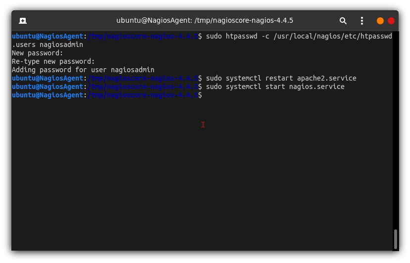

* To test the installation go to [localhost/nagios](0.0.0.0/nagios)

* To install nagios standard plugins

```
sudo apt-get install -y autoconf gcc libc6 libmcrypt-dev make libssl-dev wget bc gawk dc build-essential snmp libnet-snmp-perl gettext

#download

cd /tmp
wget --no-check-certificate -O nagios-plugins.tar.gz https://github.com/nagios-plugins/nagios-plugins/archive/release-2.2.1.tar.gz
tar zxf nagios-plugins.tar.gz

#compile

cd /tmp/nagios-plugins-release-2.2.1/
sudo ./tools/setup
sudo ./configure
sudo make
sudo make install
```
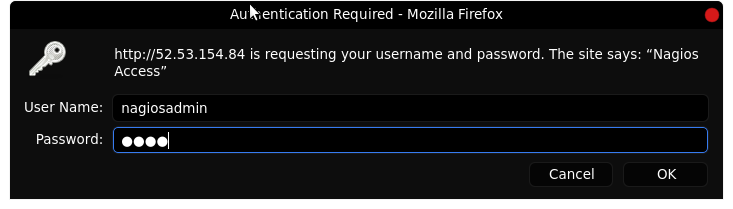
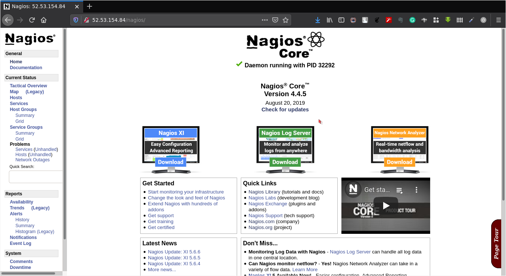
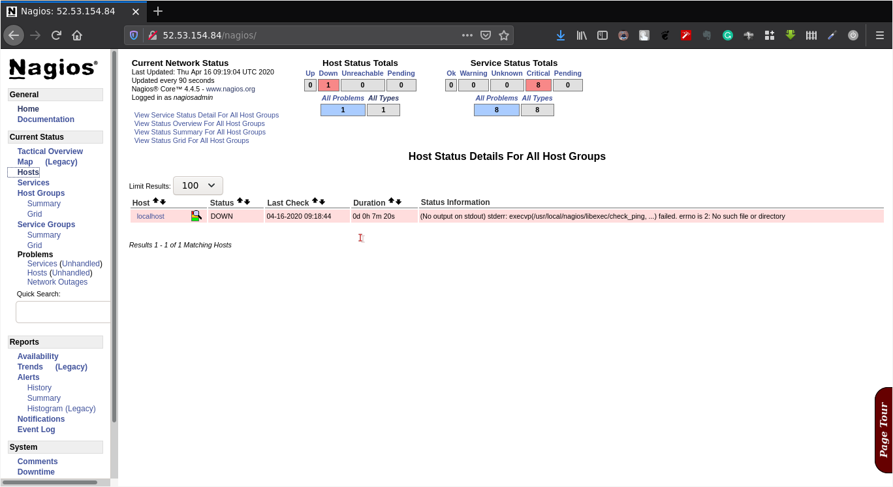

* Nagios is installed with standard plugins and to test restart nagios and go to [localhost/nagios]().

> On slave machine install _nrpe_:

* On slave machine use following command to install nrpe

```
sudo apt install nagios-nrpe-server nagios-plugins
```
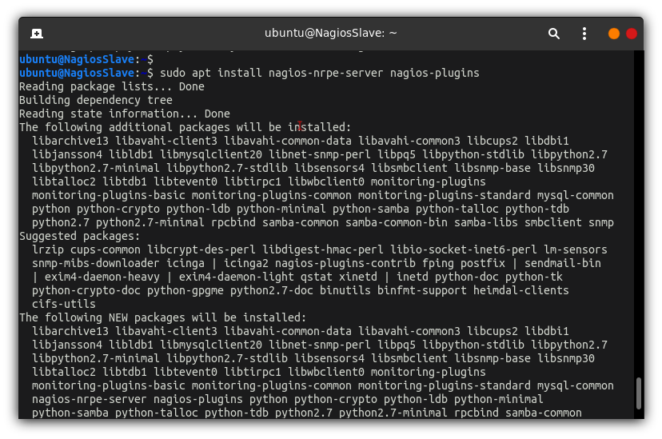

* Edit _nagios.cfg_ file to add the server as host.

```
sudo nano /etc/nagios/nrpe.cfg
```
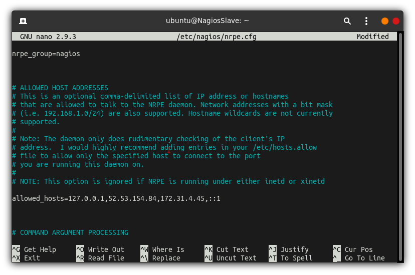

* Restart the nrpe server

```
sudo systemctl restart nagios-nrpe-server
```

> On server machine:

* Install nrpe plugin

```
sudo apt install nagios-nrpe-plugins
cp /usr/lib/nagios/plugins/check_* /usr/local/nagios/libexec
```
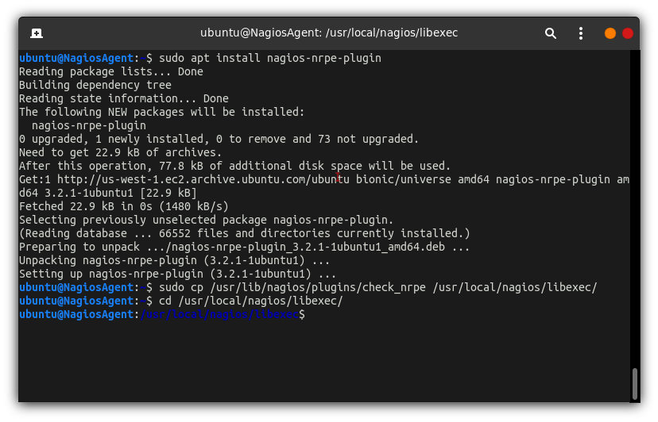

* Verify the slave

```
./check_nrpe -H <SlaveIp>
```

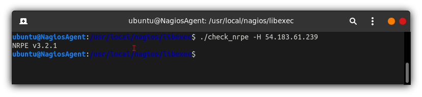

* Edit the _nagios.cfg_ to allow the new configuration file

```
sudo nano /usr/local/nagios/etc/nagios.cfg

#add line

cfg_file=/usr/local/nagios/etc/objects/main.cfg

```


* To write the nagios config file to monitor the _myserver_ for ping,http,diskusage & ssh:

```
    define host {
    use                   linux-server
    host_name             webserver
    alias                 webserver
    address               54.183.61.239
    }

    define service {
    use                   local-service
    host_name             webserver
    service_description   PING
    check_command         check_ping!100.0,20%!500.0,60%
    }

    define service {
    use                   local-service
    host_name             webserver
    service_description   HTTP
    check_command         check_http
    normal_check_interval 1
    }

    define service {
    use                   local-service
    host_name             webserver
    service_description   SSH
    check_command         check_ssh
    }

    define service {
    use                   local-service
    host_name             webserver
    service_description   Disk Usage
    check_command         check_local_disk!20%!10%!/
    }

```
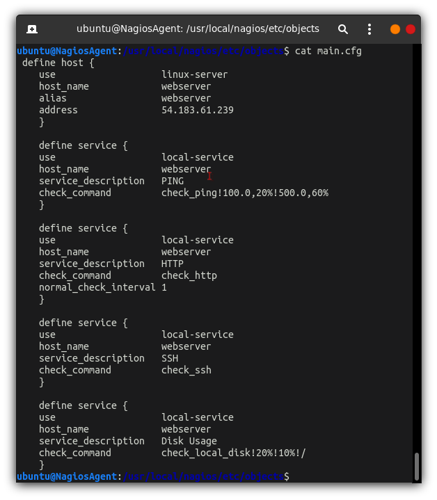

* Now go to <IPofServer>/nagios and monitor the services

```
sudo systemctl restart nagios
```

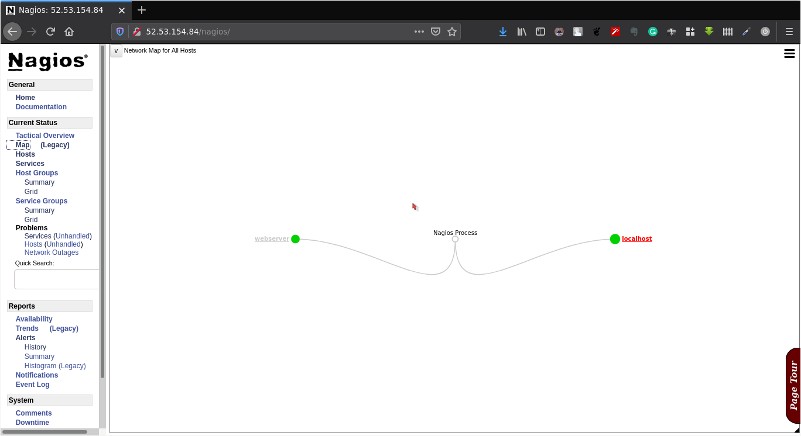
> Network is established

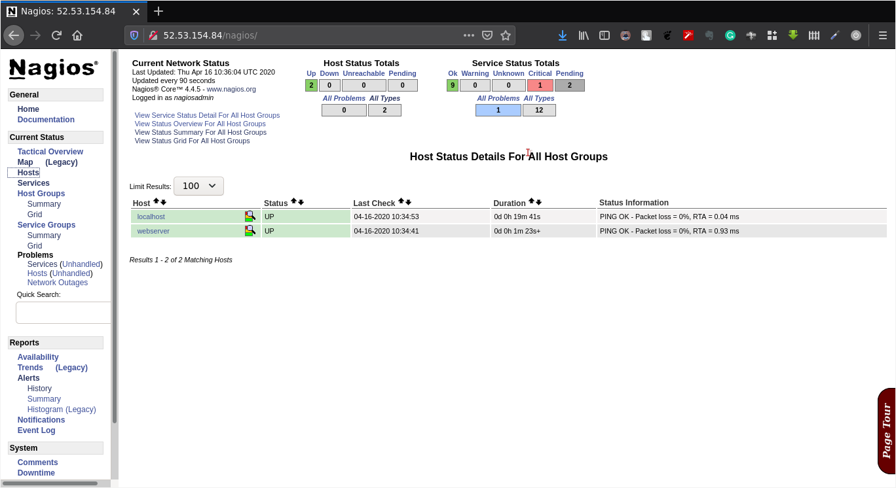
> Hosts: localhost and webserver

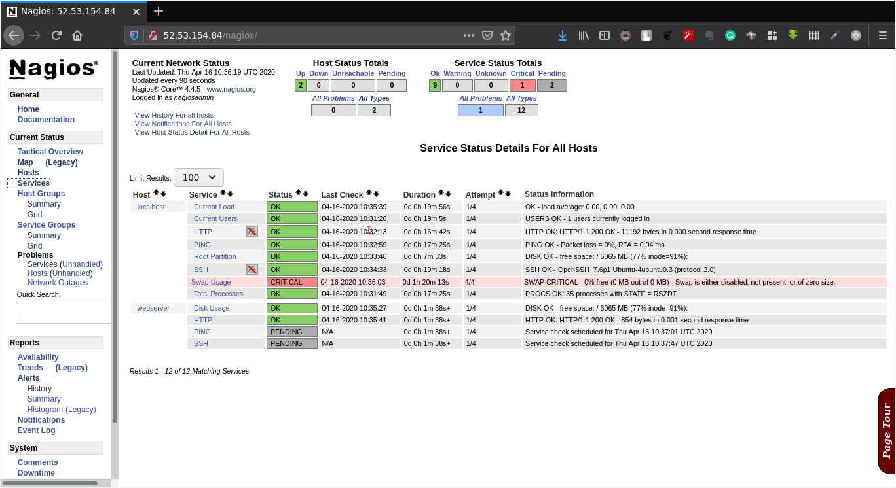
> Services and their health

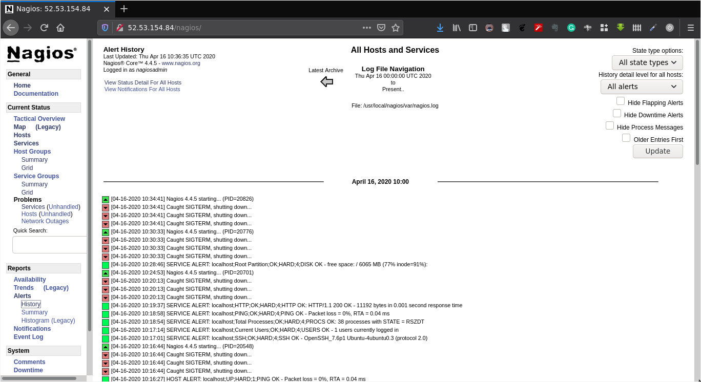
> History

* Nagios tutorial complete.


### Ansible:

* First login to the Ansible Server machine and run the following to install ansible.

```bash
sudo apt-get update -y
sudo apt-add-repository ppa:ansible/ansible
sudo apt-get update -y
sudo apt-get install ansible -y
```
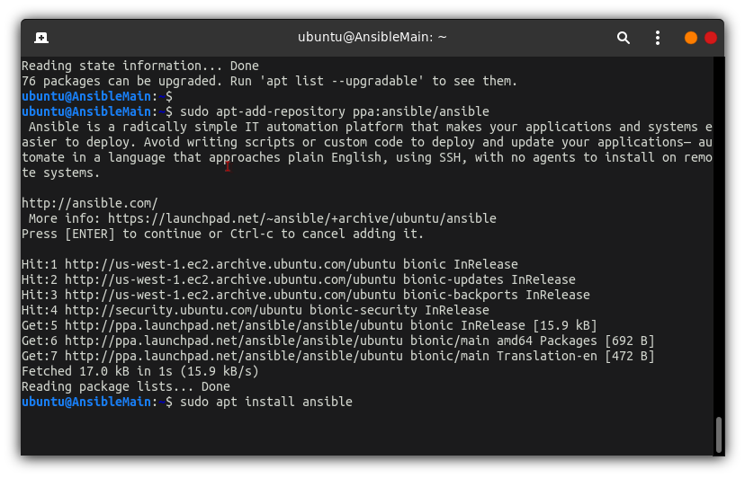

* Verify the ansible installation using:

```bash
sudo ansible --version
```
  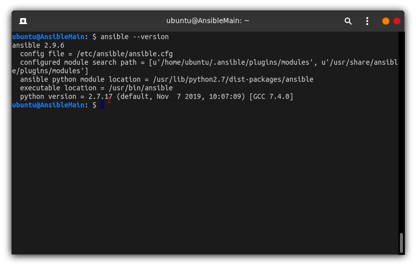

* To add host (slave machine) to our server

```
sudo nano /etc/ansible/hosts
```
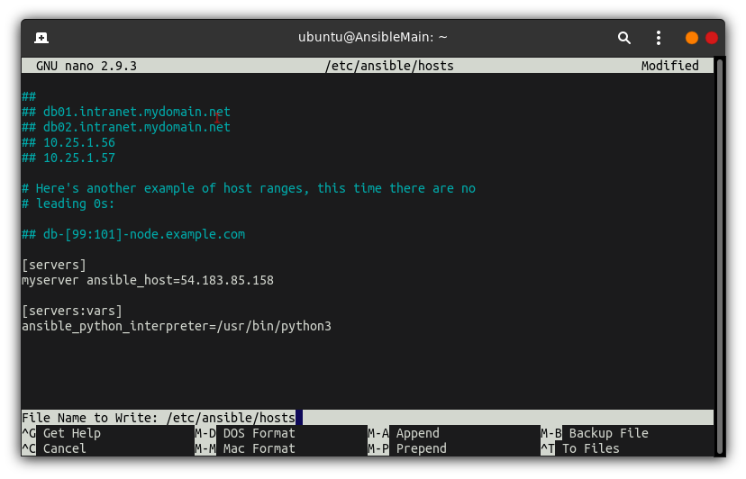


* Inspect the inventory using:

```
ansible-inventory --list -y
```
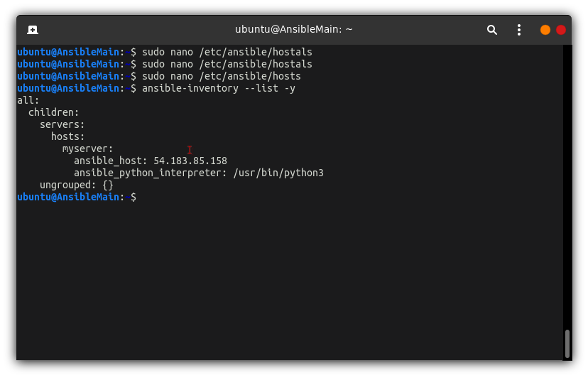

* To configure the installation, generate keygen for ssh.

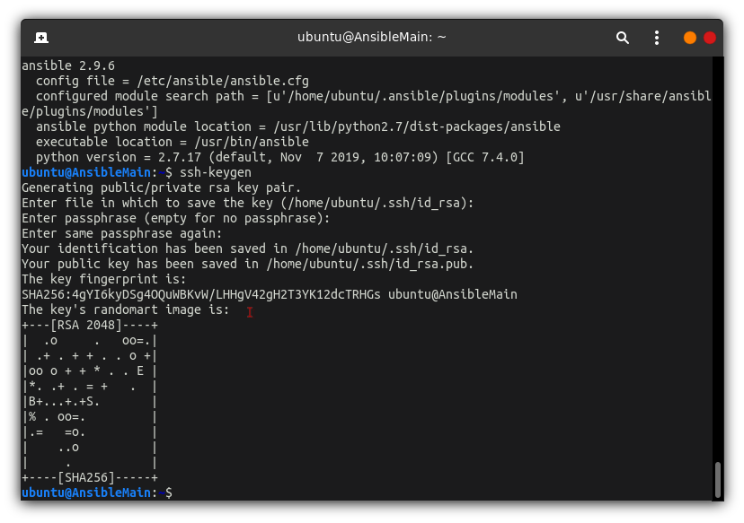

* Move to the key location and copy its _SHA_ and paste in the slave machine as follows:

```
cd ~/.ssh
ls
cat id_rsa.pub

```
> On slave machine:

```
cd ~/.ssh
nano authorized_keys
<copy SHA> 
```

* Back on server machine, to ping the server:_myserver_

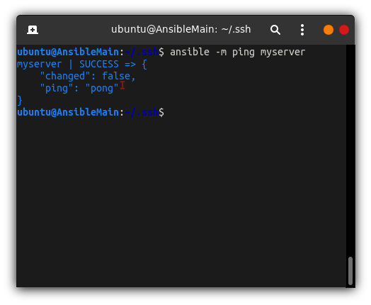

> To test apache server installation which should return error as there is no such installation on save. 

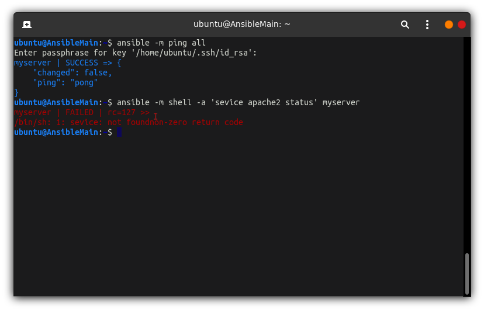

* To ssh into the machine directly:

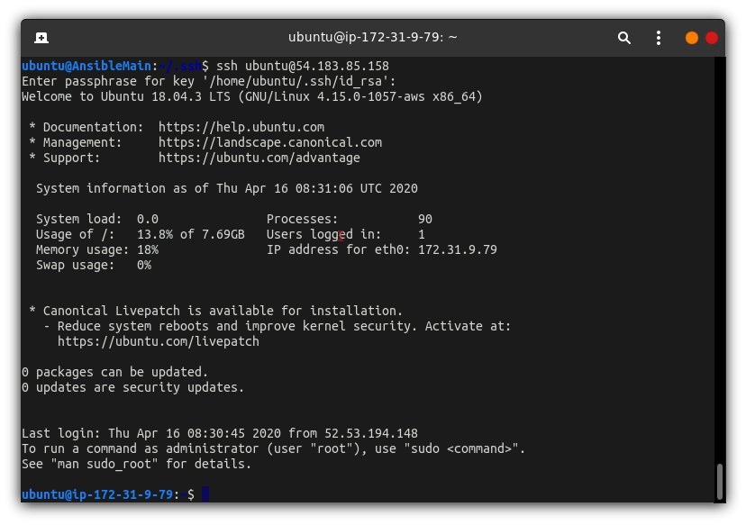

> Ansible tutorial complete.
